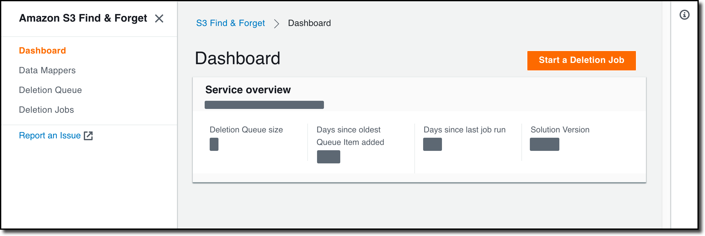

<h1 align="center">
    Amazon S3 Find and Forget
     
     
     
    
</h1>

Amazon S3 Find and Forget is a solution to the need to selectively erase records
from data lakes stored on Amazon Simple Storage Service (Amazon S3). This
solution can assist data lake operators to handle data erasure requests, for
example, pursuant to the European General Data Protection Regulation (GDPR).

The solution can be used with Parquet-format data stored in Amazon S3 buckets.
Your data lake is connected to the solution via AWS Glue tables and by
specifying which columns in the tables contain user identifiers.

Once configured, you can queue record identifiers that you want the
corresponding data erased for. You can then run a deletion job to remove the
data corresponding to the records specified from the objects in the data lake. A
report log is provided of all the S3 objects modified.

## Installation

The solution is available as an AWS CloudFormation template and should take
about 20 to 40 minutes to deploy. See the
[deployment guide](docs/USER_GUIDE.md#deploying-the-solution) to launch the
deployment with just one click and the
[cost overview guide](docs/COST_OVERVIEW.md) to learn about its costs.

> Warning: This project is currently in beta release
>
> - Actively developed by AWS
> - Carefully review code and documentation if you intend to use the solution
>   for production purposes
> - Get in touch with the team via
>   [Github Issues](https://github.com/awslabs/amazon-s3-find-and-forget/issues)
>   for providing feedback and to ask any question. We appreciate your help

## Usage

The solution provides a web user interface, and a REST API to allow you to
integrate it in your own applications.

See the [user guide](docs/USER_GUIDE.md) to learn how to use the solution and
the [API Specification](docs/api/README.md) to integrate the solution to your
own applications.

## Architecture

The goal of the solution is to provide a secure, reliable, performant and cost
effective tool for finding and removing individual records within objects stored
in S3 buckets. In order to achieve these goals the solution has adopted the
following design principles:

1. **Security first:** Every component implements least privilege access,
   encryption is performed at all layers at rest and in transit, authentication
   is provided out of the box, expiration of logs is easily configurable, and
   private data is automatically obfuscated or irreversibly deleted as soon as
   possible when persisting state.
2. **Built to scale:** The system has been designed and battle tested for
   performance and high availability with Data Lakes of TB/PB size.
3. **Cost optimised:**
   - **Perform work in batches:** Since the time complexity of removing a single
     vs multiple records in a single object is practically equal and it is
     common for data owners to have the legal requirement of removing data
     within a given _timeframe_, the solution is designed to allow the customer
     to "queue" multiple matches to be removed in a single job.
   - **Fail fast:** A deletion job takes place in two distinct phases: Find and
     Forget. The Find phase queries the objects in your S3 data lakes to find
     any objects which contain records where a specified column contains at
     least one of record identifiers (known as **Match IDs**) in the deletion
     queue. If any queries fail, the job will abandon as soon as possible and
     the Forget phase will not take place. The Forget Phase takes the list of
     objects returned from the Find phase, and deletes the relevant rows in only
     those objects.
   - **Find, then Forget:** The process of separating the two phases, as
     opposite of processing the read/write on an object basis, is another cost
     optimisation technique based on the fact columnar dense formats such as
     Parquet allow to find matches with increased performance and cost
     optimisation by reading only relevant columns instead of full content from
     all columns. By processing only the relevant columns during the Find and
     deletegating it to a serverless managed service such as Amazon Athena, we
     can then process full rows only during the Forget phase, restricting the
     most expensive operation to only the relevant objects.
   - **Serverless:** Where possible, the solution only uses Serverless
     components. All the components for Web UI, API and Deletion Jobs are
     Serverless (for more information consult the
     [Cost Overview guide](docs/COST_OVERVIEW.md)).
4. **Easy to use and operate:** The solution is designed to interact directly to
   Amazon S3 for high compatibility with existing toolsets. It provides a REST
   API to allow you to integrate it in your own applications, and a easy to use
   UI interface. When performing deletion jobs, information is provided in
   real-time to allow good observability. After the job completes, detailed
   reports are available documenting all the actions performed to individual S3
   Objects, and detailed error traces in case of failures to guide the user to
   the troubleshooting process and easily identify remediation actions (for more
   information consult the [Troubleshooting guide](docs/TROUBLESHOOTING.md)).

### High-level overview diagram

See the [Architecture guide](docs/ARCHITECTURE.md) to learn more about the
architecture.

## Documentation

- [User Guide](docs/USER_GUIDE.md)
- [Deployment](docs/USER_GUIDE.md#deploying-the-solution)
- [Architecture](docs/ARCHITECTURE.md)
- [Troubleshooting](docs/TROUBLESHOOTING.md)
- [Monitoring the Solution](docs/MONITORING.md)
- [Security](docs/SECURITY.md)
- [Cost Overview](docs/COST_OVERVIEW.md)
- [Limits](docs/LIMITS.md)
- [API Specification](docs/api/README.md)
- [Local Development](docs/LOCAL_DEVELOPMENT.md)
- [Change Log](CHANGELOG.md)

## Contributing

Contributions are more than welcome. Please read the
[code of conduct](CODE_OF_CONDUCT.md) and the
[contributing guidelines](CONTRIBUTING.md).

## License Summary

This project is licensed under the Apache-2.0 License.
