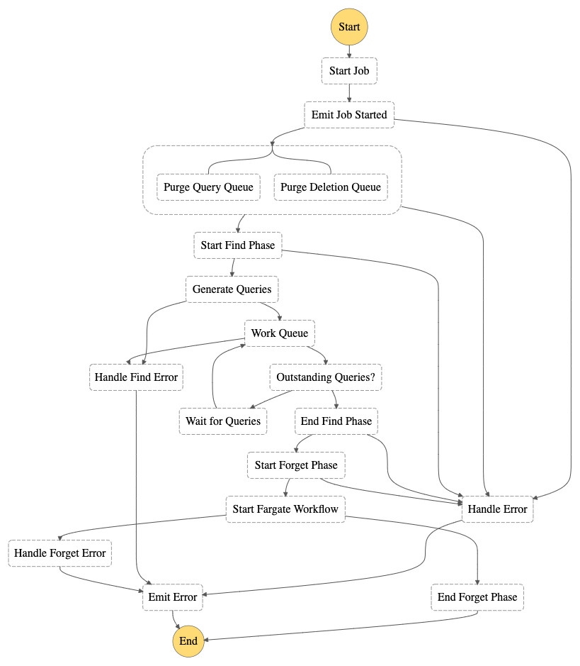
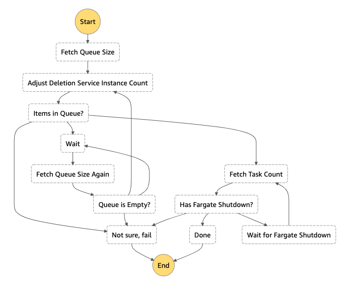

# Architecture

## Index
* [Design Principles](#design-principles)
* [Core Components](#core-components)
    * [Data Mappers](#data-mappers)
    * [Deletion Queue](#deletion-queue)
    * [Deletion Jobs](#deletion-jobs)
* [High-level Overview](#high-level-overview)
* [User Interface](#user-interface)
* [Persistence Layer](#persistence-layer)
* [Deletion Job Workflow](#deletion-job-workflow)
    * [The Athena Find workflow](#the-athena-find-workflow)
    * [The Forget workflow](#the-forget-workflow)
* [See Also](#see-also)

## Design Principles

The goal of the solution is to provide a secure, reliable, performant and cost effective tool for finding and removing individual records within objects stored in S3 buckets.
In order to achieve these goals the solution has adopted the following design principles:

1. **Perform work in batches:** Since the time complexity of removing a single vs multiple records in a single object is practically equal and it is common for data owners to have the legal requirement of removing data within a given _timeframe_, the solution is designed to allow the customer to "queue" multiple matches to be removed in a single job.
2. **Fail fast:** A deletion job takes place in two distinct phases: Find and Forget. The Find phase queries the objects in your S3 data lakes to find any objects which contain records where a specified column contains at least one of record identifiers (known as **Match IDs**) in the deletion queue. If any queries fail, the job will abandon as soon as possible and the Forget phase will not take place. The Forget Phase takes the list of objects returned from the Find phase, and deletes the relevant rows in only those objects.
3. **Serverless:** Where possible, the solution only uses Serverless components. All the components for Web UI, API and Deletion Jobs are Serverless (for more information consult the [Cost Overview guide]).

## Core components

The following terms are used to identify core components within the solution.

### Data Mappers

Data Mappers instruct the Amazon S3 Find and Forget solution how and where to search for items to be deleted.

The solution currently supports one type of Data Mapper, which leverages:
* AWS Glue as *Data Catalog Provider*, responsible of mapping objects in S3 buckets and their partitions (if they have any)
* Amazon Athena as the *Query Executor* during the [Find Phase](#the-athena-find-workflow), responsible for executing the search queries

The system allows customers to create Data Mappers at any time and removing Data Mappers when no Deletion Job is running.

### Deletion Queue

The Deletion Queue is a list of matches. A match is a value you wish to search for, which identifies rows in your S3 data lake to be deleted. For example, a match could be the ID of a specific customer.

Matches can be added at any time, and can be removed only when no deletion job is in progress.

### Deletion Jobs

A Deletion Job is an activity performed by Amazon S3 Find and Forget which queries your data in S3 defined by the Data Mappers and deletes rows containing any match present in the Deletion Queue.

Deletion jobs can be run anytime there is not another deletion job already running.

## High-level Overview

## User Interface

Interaction with the system is via the Web UI or the API.

To use the Web UI customers must authenticate themselves. The Web UI uses the same Amazon Cognito User Pool as the API. It consists of an Amazon S3 static site hosting a React.js web app, optionally distributed by an Amazon CloudFront distribution, which makes authenticated requests to the API on behalf of the customer.
Customers can also send authenticated requests directly to the API Gateway ([API specification]).

## Persistence Layer

Data Persistence is handled differently depending on the cirumstances:
* The customer performs an action that synchronously affects state such as making an API call that results on a write or update of a document in DynamoDB. In that case the Lambda API Handlers directly interact with the Database and respond accordingly following the [API specification].
* The customer performs an action that results in a contract for a asynchronous promise to be fullfilled such as running a deletion Job. In that case, the synchronous write to the database will trigger an asynchronous Lambda Job Stream Processor that will perform a variety of actions depending on the scenario, such as executing the Deletion Job Step Function. Asynchronous actions generally handle state by writing event documents to DynamoDB that are occasionally subject to further actions by the Job Stream Processor.

The data is stored in DynamoDB using 3 tables:
* **DataMappers**: Metadata for mapping S3 buckets to the solution.
* **DeletionQueue**: The queue of matches to be deleted. This data is stored in DynamoDB in order to provide an API that easily allows to inspect and occasionally amend the data between deletion jobs.
* **Jobs**: Data about deletion jobs, including the Job Summary (that contains an up-to-date representation of specific jobs over time) and Job Events (documents containing metadata about discrete events affecting a running job).

## Deletion Job Workflow

The Deletion Job workflow is implemented as an AWS Step Function. 

When a Deletion Job starts, the solution gathers the contents of the Deletion Queue and all the configured data mappers then proceeds to the Find phase.

For each supported query executor, the workflow generates a list of queries it should run based on the data mappers associated with that query executor and the partitions present in the data catalog tables associated with those data mappers. For each query, a message is added to the specific SQS queue for the relevant query executor.

When all the queries have been executed, the [Forget Workflow](#the-forget-workflow) is executed.

### The Athena Find Workflow

The Amazon S3 Find and Forget solution currently supports one type of Find Workflow, operated by an AWS Step Function that leverages Amazon Athena to query Amazon S3.

The workflow is capable of finding where specific content is located in Amazon S3 by using Athena's `$path` pseudo-parameter as part of each query. In this way the system can operate the Forget Workflow by reading/writing only relevant objects rather than whole buckets, optimising performance, reliability and cost.
When each workflow completes a query, it stores the result to the Object Deletion SQS Queue. The speed of the Find workflow depends on the Athena Concurrency (subject to account limits) and wait handlers, both configurable when deploying the solution.

### The Forget Workflow

The Forget workflow is operated by a Amazon Step Function that uses AWS Lambda and AWS Fargate for computing and Amazon DynamoDB and Amazon SQS to handle state.

When the workflow starts, a fleet of AWS Fargate tasks is instanciated to consume the Object Deletion Queue and start deleting content from the objects. When the Queue is empty, a Lambda sets the instances back to 0 in order to optimise cost. The number of Fargate tasks is configurable when deploying the solution.

## See Also

* [API Specification]
* [Cost Overview guide]
* [Limits]
* [Monitoring guide]

[API Specification]: API_SPEC.md
[Cost Overview guide]: COST_OVERVIEW.md
[Limits]: LIMITS.md
[Monitoring guide]: MONITORING.md
