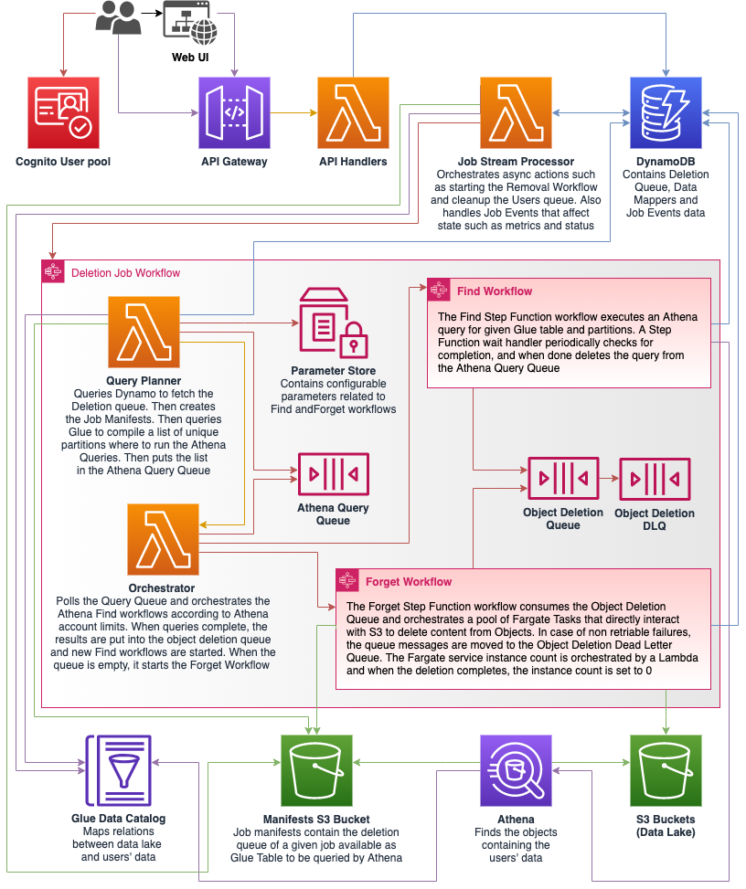

# Architecture

## Index
* [Introduction](#introduction)
* [High-level overview](#high-level-overview)
* [User Interface](#user-interface)
* [State Management](#state-management)
* [Deletion Job Workflow](#deletion-job-workflow)
    * [The Find workflow](#the-find-workflow)
    * [The Forget workflow](#the-forget-workflow)
* [Monitoring](#monitoring)
* [Cost Overview](#cost-overview)

## Introduction

The goal of the solution is to provide secure, reliable, performant and cost effective tools for finding and removing Personal Identifiable Information (PII) on S3 buckets.
In order to achieve these goals the solution has adopted the following design principles:

1. It is common for data owners to have the legal requirement of removing PII data within a given period such as 15 or 30 days. Given most of the read/write operations to S3 require similar cost when single files contain data of multiple users, the solution allows to create a queue of users to delete in order to leverage this requirement to save costs by allowing the removal of multiple users to be batched in the so called "Deletion Job". Running a deletion Job in a sensible cadence is responsibility of the customer.
2. The deletion job is based on two separate phases called Find and Forget. The Find phase leverages Amazon Athena and its possibility to query S3 to find the exact location of specific matches (by using the `$path` pseudo-column). By running this first step independently the solution is able to determine an accurate list of the specific objects containing PII data belonging to specific users. Athena provides this functionality in a performant, secure and cost effective way ([Amazon Athena pricing](https://aws.amazon.com/athena/pricing/)). The Forget Phase consists on operating surgical removals from the specific objects rather than the whole lake, allowing great savings on S3 reads and computing, when compared to scanning the whole data lake.
3. The solution is designed with Serverless in mind. All the components for Web UI, API and Removal Jobs are Serverless with the exception of the VPC needed to run the solution.

## High-level overview

## User Interface

For interacting with the system, the users can use the Web UI, or the API.

The Web UI allows authenticated requests to the API layer by using Amazon Cognito User Pools. It consists of a Amazon S3 static site hosting a React.js web app, optionally distributed by a Amazon CloudFront distribution.
The API Gateway allows to be used directly by users by sending authenticated requests ([API specification](API_SPEC.md)).

## State Management

State is handled differently depending on the cirumstances:
* The user performs an action that synchronously affects state such as making an API call that results on a write or update of a document in DynamoDB. In that case the Lambda API Handlers directly interact with the Database and respond accordingly following the [API specification](API_SPEC.md).
* The user performs an action that results in a contract for a asynchronous promise to be fullfilled such as running a deletion Job. In that case, the synchronous write to the database will trigger an asynchronous Lambda Job Stream Processor that will perform a variety of actions depending on the scenario, such as executing the Deletion Job Step Function. Asynchronous actions generally handle state by writing event documents to DynamoDB that are occasionally subject to further actions by the Job Stream Processor.

The data is stored in DynamoDB using 3 tables:
* **DataMappers**: Metadata for mapping S3 buckets to the solution.
* **DeletionQueue**: The queue of users to be deleted. This data is stored in DynamoDB in order to provide an API that easily allows to inspect and occasionally amend the data between deletion jobs.
* **Jobs**: Data about deletion jobs, including the Job Summary (that contains an up-to-date representation of specific jobs over time) and Job Events (documents containing metadata about discrete events affecting a running job).

## Deletion Job Workflow

The Deletion Job workflow is operated by a AWS Step Function that uses AWS Lambda for computing, Amazon DynamoDB and Amazon SQS to handle state, and nested AWS Step Functions to execute the Find and Forget phases.

When a Deletion Job starts, the solution first queries DynamoDB to fetch the Users queue, then queries AWS Glue to compile a list of unique partitions where to run the Athena Queries. It then puts the list in the Athena Query SQS Queue.

The flow then proceeds orchestrating Athena [Find workflows](#the-find-workflow) execution accordingly to Athena account limits for optimising concurrency and achieve best speed and reliability at minimum cost.

When all the queries have been executed, the [Forget Workflow](#the-forget-workflow) starts.

### The Find Workflow

The Find workflow is operated by a AWS Step Function that uses AWS Lambda for computing and Amazon Athena to query Amazon S3.

The Find workflow is based on using Athena to find where specific content is located in Amazon S3 by using Athena's `$path` pseudo-parameter. In this way the system can operate the Forget Workflow by reading/writing only relevant objects rather than whole buckets, optimising performance, reliability and cost.
When each workflow completes a query, it stores the result to the Object Deletion SQS Queue. The speed of the Find workflow depends on the Athena Concurrency (subject to account limits) and wait handlers, both configurable when deploying the solution.

### The Forget Workflow

The Forget workflow is operated by a Amazon Step Function that uses AWS Lambda and AWS Fargate for computing and Amazon DynamoDB and Amazon SQS to handle state.

When the workflow starts, a fleet of AWS Fargate tasks is instanciated to consume the Object Deletion Queue and start deleting content from the objects. When the Queue is empty, a Lambda sets the instances back to 0 in order to optimise cost. The number of Fargate tasks is configurable when deploying the solution.

## Monitoring

Please refer to the [Monitoring guide](MONITORING.md)

## Cost Overview

Please refer to the [Cost Overview guide](COST_OVERVIEW.md)
